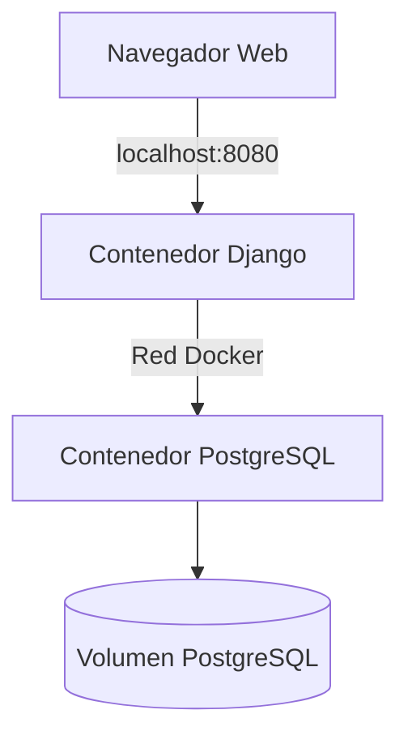

# Informe Técnico - Laboratorio 5: Despliegue de una aplicación Django con Docker

## Diagrama de Arquitectura del Sistema



**Descripción:**  
- **Navegador Web:** Accede a la aplicación Django a través del puerto `8080`.  
- **Contenedor Django:** Ejecuta la aplicación web y se comunica con PostgreSQL a través de una red Docker personalizada.  
- **Contenedor PostgreSQL:** Almacena los datos de la aplicación. Utiliza un volumen para persistencia (`db_data`).  
- **Red Docker:** Conecta los contenedores Django y PostgreSQL.  

---

## Explicación de Archivos Clave

### 1. `Dockerfile` (Aplicación Django)
```dockerfile
# Imagen base
FROM python:3.9-slim

# Configuración del entorno
ENV PYTHONDONTWRITEBYTECODE 1
ENV PYTHONUNBUFFERED 1

# Instalación de dependencias
WORKDIR /app
COPY requirements.txt .
RUN pip install --no-cache-dir -r requirements.txt

# Copiar el proyecto y configurar el entrypoint
COPY . .
CMD ["gunicorn", "--bind", "0.0.0.0:8000", "proyecto.wsgi:application"]
```

**Funcionalidad:**  
- Crea una imagen basada en Python 3.9.  
- Instala dependencias desde `requirements.txt` (incluye Django, psycopg2-binary, y gunicorn).  
- Expone el puerto `8000` y ejecuta la aplicación con Gunicorn.  

---

### 2. `docker-compose.yml`
```yaml
version: '3.8'

services:
  web:
    build: .
    ports:
      - "8080:8000"
    env_file:
      - .env
    depends_on:
      - db
    networks:
      - lab_network

  db:
    image: postgres:13
    env_file:
      - .env
    volumes:
      - db_data:/var/lib/postgresql/data
    networks:
      - lab_network

volumes:
  db_data:

networks:
  lab_network:
    driver: bridge
```

**Funcionalidad:**  
- **Servicio `web`:** Construye la imagen Django, mapea el puerto `8080` y usa variables de entorno.  
- **Servicio `db`:** Usa PostgreSQL 13, persiste datos en el volumen `db_data` y comparte la red `lab_network`.  

---

### 3. `.env` (Ejemplo)
```ini
POSTGRES_DB=mydb
POSTGRES_USER=user
POSTGRES_PASSWORD=password
SECRET_KEY=django-insecure-secretkey
```

**Nota:** Este archivo debe ignorarse en Git (añadir a `.gitignore`).  

---

## Instrucciones para Ejecutar el Entorno

1. **Clonar el repositorio:**
   ```bash
   git clone <repositorio>
   cd <directorio>
   ```

2. **Crear y configurar `.env`:**
   ```bash
   cp .env.example .env
   # Editar .env con credenciales reales
   ```

3. **Construir y levantar los contenedores:**
   ```bash
   docker-compose up --build
   ```

4. **Aplicar migraciones (en otra terminal):**
   ```bash
   docker-compose exec web python manage.py migrate
   ```

5. **Acceder a la aplicación:**  
   Abrir `http://localhost:8080` en el navegador.  

---

## Capturas de Pantalla

1. **Aplicación Django en funcionamiento:**  
     
   *Descripción: Página principal de la aplicación Django.*  

2. **Contenedores en ejecución:**  
     
   *Descripción: Salida de `docker ps` mostrando los contenedores activos.*  

3. **Base de datos persistente:**  
     
   *Descripción: Verificación del volumen `db_data` con `docker volume inspect`.*  

---

## Notas Finales
- **Reproducibilidad:** El entorno se inicia con un solo comando (`docker-compose up`).  
- **Buenas prácticas:** Uso de volúmenes, redes personalizadas y variables de entorno.  
- **Extensibilidad:** La estructura permite añadir más servicios (ej: Redis) fácilmente.  
``` 

**Reemplazar** las URLs de las capturas con imágenes reales. Para generarlas, puede usar herramientas como [Lightshot](https://app.prntscr.com/) o la función de captura de pantalla de su sistema operativo.
